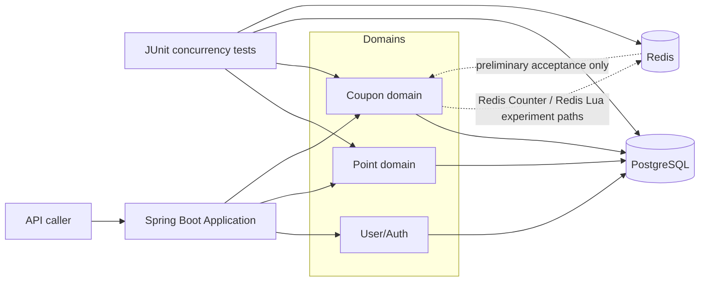
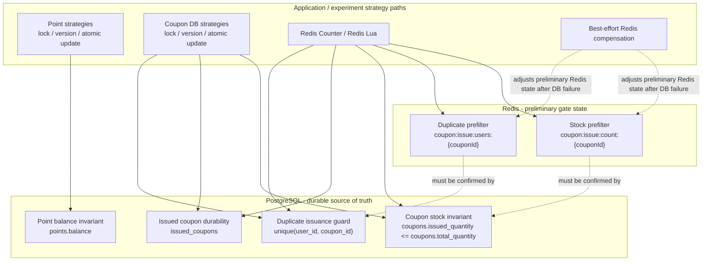

# Architecture

## 1. Purpose and Scope

This document describes the architecture of the currently implemented system.

It focuses on:

- User/Auth, Point, and Coupon modules
- PostgreSQL as the durable data store
- Redis Counter and Redis Lua as coupon issuance gate experiments
- concurrency tests as the verification harness
- consistency ownership between application code, PostgreSQL, and Redis

This document does not describe planned Product, Order, Payment, or coupon usage architecture.

## 2. Implemented System Overview

The application is a Java 21 Spring Boot service backed by PostgreSQL and Redis.

PostgreSQL stores durable application state:

- users
- point balances
- coupon definitions and issued quantity
- issued coupon records

Redis is used only by the Redis-based coupon issuance experiments. It acts as a front-line gate before PostgreSQL persistence. Redis does not replace PostgreSQL as the durable source of truth.

Concurrency behavior is verified through JUnit tests that execute high-contention scenarios against real PostgreSQL and Redis services.

### System Component Diagram

## 3. Runtime Code vs Experiment Code

The repository contains both runtime application code and experiment-specific test code.

Runtime code:

- User signup and lookup
- JWT login and authentication
- Point charge, deduction, and balance APIs
- Transaction-only coupon issuance service path

Experiment code:

- Point concurrency tests for transaction-only, pessimistic lock, optimistic lock, and atomic update paths
- Coupon concurrency tests for duplicate issuance, stock control, Redis Counter, and Redis Lua paths
- Redis Counter and Redis Lua implementations inside `CouponIssueConcurrencyTest.TestCouponIssueService`

The Redis Counter and Redis Lua paths are implemented as concurrency experiment paths, not as production-facing coupon service APIs.

## 4. Module Layout

| Module | Main responsibility |
| --- | --- |
| `auth` | Login and JWT response handling |
| `domain/user` | User signup, user persistence, user role |
| `domain/point` | Point wallet, charge, deduction, concurrency strategy experiments |
| `domain/coupon` | Coupon definition, issued coupon records, issuance persistence rules |
| `global/security` | Security filter, user details integration, JWT validation |
| `src/test/.../point` | Point concurrency verification |
| `src/test/.../coupon` | Coupon concurrency and Redis gate verification |

The architecture keeps the concurrency strategies explicit and separable so that each strategy can be tested against the same business invariant.

## 5. Storage Ownership

PostgreSQL owns durable state.

| State | Owner | Notes |
| --- | --- | --- |
| User account | PostgreSQL | Stored through `UserRepository` |
| Point balance | PostgreSQL | Stored in `points`; protected by selected point strategy |
| Coupon stock | PostgreSQL | Stored in `coupons.total_quantity` and `coupons.issued_quantity` |
| Issued coupon ownership | PostgreSQL | Stored in `issued_coupons` |
| User-coupon uniqueness | PostgreSQL | Enforced by unique constraint on `(user_id, coupon_id)` |
| Redis accepted coupon count | Redis | Preliminary gate state, not durable issuance truth |
| Redis accepted coupon users | Redis | Preliminary duplicate gate state for Redis Lua |

Redis state can reduce database write-path pressure, but final correctness depends on PostgreSQL persistence and constraints.

## 6. Point Domain Architecture

The Point domain stores one point balance per user in PostgreSQL.

Implemented consistency strategies:

- Transaction-only read-modify-write baseline
- Pessimistic lock
- Optimistic lock without retry
- Atomic update

The core invariant is that the final point balance must match the number of successful deductions. Pessimistic lock and atomic update produce deterministic results for the fixed high-contention test scenario. Optimistic lock detects conflicts and prevents silent overwrites, but without retry the exact number of successful requests can vary.

Detailed Point strategy behavior is documented in [Point Concurrency Strategy Comparison](point-concurrency-strategy-comparison.md).

## 7. Coupon Domain Architecture

The Coupon domain has two durable state types:

- `Coupon`: coupon definition and issued quantity
- `IssuedCoupon`: coupon ownership by user

The main durable invariants are:

- `Coupon.issuedQuantity` must not exceed `Coupon.totalQuantity`.
- One user can have at most one issued coupon for the same coupon.
- Successful issuance should create an `IssuedCoupon` record and update coupon inventory consistently.

PostgreSQL enforces user-coupon uniqueness through the `issued_coupons(user_id, coupon_id)` unique constraint.

The conditional stock update in `CouponRepository.increaseIssuedQuantityIfStockAvailable(...)` is the database-side stock guard used by the atomic update and Redis-based experiment paths.

Detailed Coupon model design is documented in [Coupon Domain Design](coupon-domain-design.md).

## 8. Coupon Issuance Strategy Placement

| Strategy | First decision point | Final durable guard |
| --- | --- | --- |
| Transaction-only baseline | Application read-modify-write flow | PostgreSQL transaction only; insufficient under contention |
| DB Unique Constraint | PostgreSQL insert boundary | Unique constraint on `(user_id, coupon_id)` |
| Pessimistic Lock | PostgreSQL row lock on `Coupon` | PostgreSQL transaction and row lock |
| Optimistic Lock without retry | JPA `@Version` check | PostgreSQL versioned update |
| Atomic Update | PostgreSQL conditional update | Conditional stock update + DB unique constraint |
| Redis Counter | Redis count key | PostgreSQL conditional stock update + DB unique constraint |
| Redis Lua | Redis count key and user set | PostgreSQL conditional stock update + DB unique constraint |

The strategy comparison documents contain detailed result interpretation and trade-offs. This table shows where each strategy sits architecturally.

## 9. Redis Front-Line Gate Architecture

Redis is used before PostgreSQL persistence in two coupon issuance experiment paths.

Redis Counter:

- Uses `coupon:issue:count:{couponId}`.
- Accepts only stock-sized Redis counter slots.
- Does not track user ids.
- Does not prevent duplicate issuance by itself.

Redis Lua:

- Uses `coupon:issue:count:{couponId}`.
- Uses `coupon:issue:users:{couponId}`.
- Checks duplicate user state and stock state inside Redis before database persistence.
- Still depends on PostgreSQL for durable issuance state and final duplicate protection.

Both Redis strategies persist accepted requests through PostgreSQL. If Redis accepts a request and database persistence fails inside the tested persistence block, the implementation attempts Redis compensation.

Detailed Redis/PostgreSQL failure windows and compensation behavior are documented in [Redis and PostgreSQL Consistency Boundary](redis-consistency-boundary.md).

## 10. Consistency Responsibility Map

### Consistency Responsibility Diagram

Responsibility summary:

| Invariant | Owner |
| --- | --- |
| Point balance durability | PostgreSQL |
| Point lost update prevention | Selected Point strategy |
| Coupon stock durability | PostgreSQL |
| Coupon duplicate durability | PostgreSQL unique constraint |
| Redis-side stock prefilter | Redis Counter or Redis Lua |
| Redis-side duplicate prefilter | Redis Lua |
| Redis/PostgreSQL atomic commit | Not implemented |
| Redis/PostgreSQL reconciliation | Not implemented |

## 11. Verification Architecture

Concurrency behavior is verified through JUnit tests.

The tests use:

- real PostgreSQL configured through Docker Compose
- real Redis configured through Docker Compose
- concurrent request execution with latches and thread pools
- final database assertions
- Redis state assertions for Redis strategies

Verification focuses on final persisted state:

- point balance
- coupon issued quantity
- issued coupon record count
- duplicate issued coupon count
- Redis count key
- Redis user set size 

The tests validate correctness properties rather than benchmark performance characteristics.

Local execution commands and inspection commands are documented in [Concurrency Experiment Runbook](runbook.md).

## 12. Current Limitations and Out of Scope

Current limitations:

- Redis Counter and Redis Lua are experiment paths in concurrency tests.
- Redis and PostgreSQL do not share one atomic commit boundary.
- Redis compensation is best-effort.
- Redis rebuild and reconciliation are not implemented.
- Redis key TTL strategy is not implemented.
- Idempotency tokens for retries are not implemented.
- Product, Order, Payment, and coupon usage workflows are not implemented.

Out of scope for this architecture document:

- Future payment architecture
- Product and order modeling
- Coupon usage consistency experiments
- Detailed performance benchmarking
- General Spring Boot architecture explanation

## 13. Related Documents

- [README](../README.md)
- [Concurrency Experiment Runbook](runbook.md)
- [Point Concurrency Strategy Comparison](point-concurrency-strategy-comparison.md)
- [Coupon Concurrency Strategy Comparison](coupon-concurrency-strategy-comparison.md)
- [Coupon Domain Design](coupon-domain-design.md)
- [Redis and PostgreSQL Consistency Boundary](redis-consistency-boundary.md)
